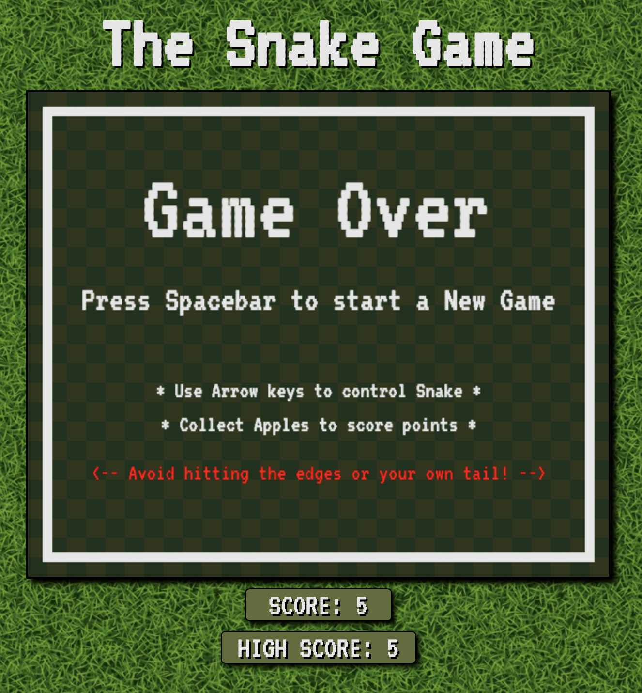

# The Snake Game

### A Snake Game created with HTML, CSS, Javascript.

### See it [here](https://bryangk.github.io/snake_game/)

## Summary

This was one of the first games I've made, and certainly the best I've made so far. Working with HTML canvas was challenging, I needed google a lot here. Once I figured out to make the snake and apple stay on a grid everything fell into place. The styling was also an interesting challenge. Trying to make the snake look snake-like and the same for the apple was difficult, and could certainly use more refining here. I am happy with how it turned out, even though I could spend more time on the project, it was time to move on to my next challenge.

## Author

Bryan Krauss - Full Stack Software Developer - [LinkedIn](https://www.linkedin.com/in/bryan-krauss-556b3a200/)